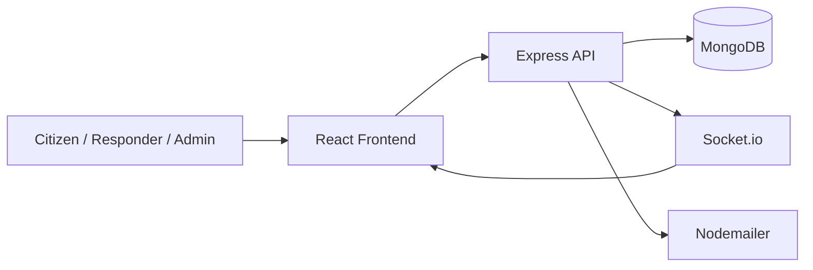

# Quick Response Coordination System

A full-stack emergency response platform for reporting incidents, coordinating teams, and delivering real-time notifications across citizen, responder, and admin workflows.

## What it does

Quick Response Coordination System, or QRCS, brings together incident reporting, role-based dashboards, live notification delivery, and operational coordination tools in one app. It is designed to help communities route urgent events quickly, keep responders informed, and give administrators a central place to oversee activity.

## Core capabilities

- Public landing experience with service highlights and platform overview
- Secure authentication with login, registration, password recovery, and reset flows
- Role-based dashboards for Admin, Citizen, and Responder users
- Incident reporting and incident lifecycle management
- Real-time notifications powered by Socket.io
- Team and resource management on the backend
- Profile and account management for authenticated users
- Protected routes with automatic redirects based on user role

## Tech stack

- Frontend: React, React Router, Vite, Tailwind CSS, Leaflet, Socket.io client
- Backend: Node.js, Express, MongoDB, Mongoose, Socket.io
- Auth and security: JSON Web Tokens, bcryptjs, middleware-based route protection
- Email: Nodemailer for password recovery and notifications

## Architecture



## Project structure

```text
QRCS/
├── QRCS-project/
│   ├── backend/
│   └── frontend/
├── README.md
└── package-lock.json
```

## Getting started

### Prerequisites

- Node.js 18+
- MongoDB connection string
- SMTP credentials for email flows

### Backend setup

```bash
cd QRCS-project/backend
npm install
```

Create a `.env` file in `QRCS-project/backend/` with the variables used by the server:

```bash
PORT=5000
MONGO_URL=your_mongodb_connection_string
JWT_SECRET=your_jwt_secret
CLIENT_URL=http://localhost:5173
SMTP_HOST=smtp.gmail.com
SMTP_PORT=587
SMTP_USER=your_email@example.com
SMTP_PASS=your_app_password
FROM_NAME=QRCS Admin
FROM_EMAIL=your_email@example.com
```

Start the API:

```bash
node server.js
```

### Frontend setup

```bash
cd QRCS-project/frontend
npm install
npm run dev
```

The app runs on Vite at the URL shown in the terminal, usually `http://localhost:5173`.

## Available scripts

### Backend

- `node server.js` starts the API server
- `nodemon server.js` can be used for local development if you prefer auto-reload

### Frontend

- `npm run dev` starts the Vite development server
- `npm run build` creates a production build
- `npm run lint` runs ESLint
- `npm run preview` serves the built frontend locally

## Key routes

### Frontend

- `/` Home page
- `/login` Authentication
- `/register` Registration
- `/forgot-password` Password recovery
- `/reset-password/:token` Password reset
- `/admin` Admin dashboard
- `/citizen` Citizen dashboard
- `/responder` Responder dashboard
- `/report` Incident reporting
- `/profile` User profile

### Backend

- `/api/auth`
- `/api/admin`
- `/api/incidents`
- `/api/teams`
- `/api/notifications`

## Environment notes

The backend expects a MongoDB URL, JWT secret, and email configuration. The frontend is configured through the app itself and the Vite development server.

## Development tips

- Keep the backend and frontend running in separate terminals while developing.
- Make sure `CLIENT_URL` matches the frontend origin so password reset links resolve correctly.
- If notifications are not appearing in real time, verify the Socket.io connection and browser console logs.

## Status

This repository currently contains the full application source for QRCS and is ready for local development or deployment setup.
